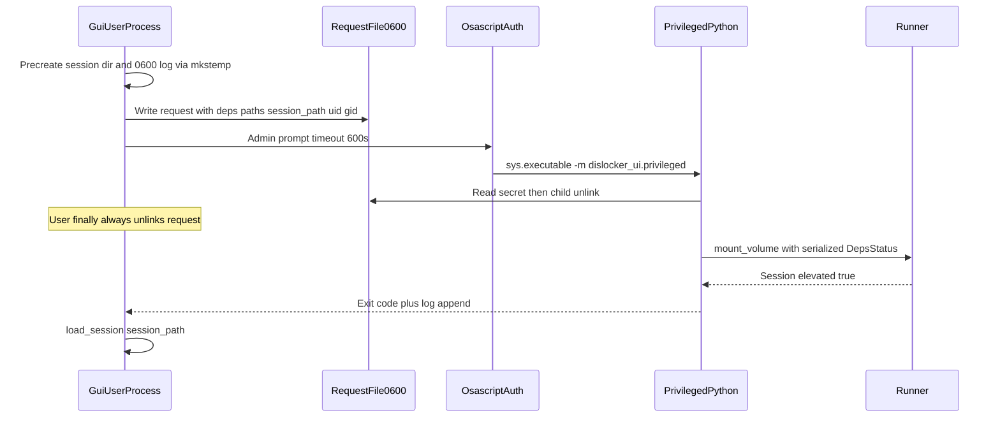

# macOS admin elevation for mount/unmount

Revised after advisor review (Claude Opus). Status: ready to implement on `feature/macos-elevation` as **0.2.0**.

## Advisor verdict

**APPROVE WITH CHANGES.** Elevation architecture kept; plan revised for blockers on this machine (macOS 26 / Darwin 25.5): stock `mount_ntfs` is gone, so the default RO path is already dead even before elevation.

## Problem

1. `/dev/disk*` is `root:operator` mode `640`. The GUI user is not in `operator`, so `dislocker-fuse` fails with `Permission denied`.
2. On macOS 26, `/sbin/mount_ntfs` and `ntfs.fs/.../mount_ntfs` do **not exist**. `runner.py` default RO path `mount -t ntfs -o rdonly` cannot work. `ntfs-3g` is installed and must become required for RO and RW.

## Chosen approach

**Elevate the full mount/unmount pipeline** via `osascript` (`do shell script … with administrator privileges`). Keep the tkinter GUI unprivileged. Reuse runner logic in a privileged child.

**Why full pipeline:** elevating only `dislocker-fuse` still leaves `/Volumes` mkdir and NTFS mount needing root, and `allow_other` would land on dislocker (no `uid=`/`gid=`). Full elevation moves `allow_other` onto **ntfs-3g**, which supports `uid=`, `gid=`, `umask=`, etc., so Finder can read/write as the original user. Only root may pass `allow_other` when `/etc/fuse.conf` has no `user_allow_other` (true on this machine).

## Branch / version

- Branch: `feature/macos-elevation` from `main`
- Semver: **0.2.0**
- Update `VERSION`, `CHANGELOG.md`, `README.md`, `AGENTS.md`
- Fix README “currently 0.1.5” vs `VERSION` `0.1.6` drift while editing

## Implementation checklist

### 0. NTFS: require ntfs-3g (blocker)

- [ ] `deps.py`: treat `ntfs-3g` as **core** on Darwin (required for both RO and RW). Update `core_ok` / missing-tool messaging / GUI hints.
- [ ] `runner.py` `_mount_ntfs`: drop kernel `mount -t ntfs`. Always use ntfs-3g.
- [ ] Options: `ro` or RW defaults, plus `allow_other,local,uid=<orig_uid>,gid=<orig_gid>,volname=<label>`.
- [ ] Docs: ntfs-3g moves from optional to required on modern macOS.

### 1. New `src/dislocker_ui/elevate.py`

- [ ] Elevation predicate: **Darwin and `os.geteuid() != 0`**. Keep `volume_needs_elevation()` for UI messaging only.
- [ ] `subprocess.run(["/usr/bin/osascript", "-e", script], …)` — never `shell=True`.
- [ ] Two-layer quoting: `shlex.quote` then AppleScript-escape. Do **not** use `json.dumps` as AppleScript escaper.
- [ ] Secrets out of AppleScript: only `mkstemp` request path + constant prompt.
- [ ] `with timeout of 600 seconds`.
- [ ] Map cancel (`-128`) to a distinct error; do not `clear_session` on unmount cancel.

### 2. New `src/dislocker_ui/privileged.py`

- [ ] CLI: `<sys.executable> -m dislocker_ui.privileged mount|unmount --request PATH`
- [ ] Request JSON (`mkstemp` 0600): action, mount fields, `session_path`, `log_path`, `uid`/`gid`, **serialized `DepsStatus`**
- [ ] Child must **not** call `discover_deps()` (root PATH misses Homebrew)
- [ ] Parent sets `sys.executable` + `PYTHONPATH=<absolute src>`

### 3. Request / log / session lifecycle (security)

- [ ] User process pre-creates Application Support dir, session path, and 0600 log via `mkstemp`
- [ ] User process always `unlink`s request in its own `finally` (covers auth cancel)
- [ ] Child opens log append-only; uses request `session_path` only; `chown` session file after success
- [ ] Document: elevating a user-writable repo is no stronger than `sudo ./run.sh`

### 4. Session + runner plumbing

- [ ] Add `MountSession.elevated: bool = False`
- [ ] Plumb `session_path` through all five runner sites: save, load (unmount), clear (success), load (validate), **`clear_session` in `_best_effort_cleanup`**
- [ ] Elevated path: `dislocker-fuse` → log-file fd + `start_new_session=True`; wait errors from log tail
- [ ] Unmount re-elevates when `session.elevated` (second password prompt — document)
- [ ] Already-root: keep in-process path

### 5. GUI

- [ ] Log `Requesting administrator privileges…`
- [ ] Distinct message on cancel (`-128`)
- [ ] No new buttons

### 6. Tests / docs

- [ ] Pure logic in `elevate.py` / `privileged.py` (coverage counts; `runner` remains omitted)
- [ ] Mocked unit tests: predicate, quoting, request serialize/parse, deps round-trip, secret absent from AppleScript, `elevated` flag
- [ ] Darwin-only, no-auth osascript round-trip test
- [ ] Manual checklist: RO mount, RW mount + write as user, cancel prompt, unmount, remount
- [ ] README: admin dialog; `sudo` fallback; ntfs-3g required; macFUSE caveat for elevated path
- [ ] AGENTS.md: elevated child, request-file pattern, ntfs-3g required on Darwin

### 7. Out of scope

- SMJobBless / launchd helpers
- Linux/Windows elevation
- Changing dislocker password delivery away from CLI flags
- Auto-adding user to `operator`
- Full FUSE-T validation in 0.2.0 (document caveat instead)

## Prioritized risks addressed

| Risk | Plan response |
|------|----------------|
| No `mount_ntfs` on macOS 26 | ntfs-3g required; RO via `-o ro` |
| Root sanitized PATH misses Homebrew | Serialize DepsStatus into request |
| Root ntfs-3g without uid/gid | Pass uid/gid/allow_other/local/volname |
| FUSE daemon SIGPIPE on parent exit | log fd + start_new_session |
| Secret file on cancel | User-process finally unlink |
| Root-owned Application Support dir | Pre-create as user before elevate |
| cleanup clear_session wrong path | Plumb session_path including cleanup |
| AppleEvent timeout | 600s wrapper |
| FUSE-T unknown | README macFUSE-only caveat for elevated path |
